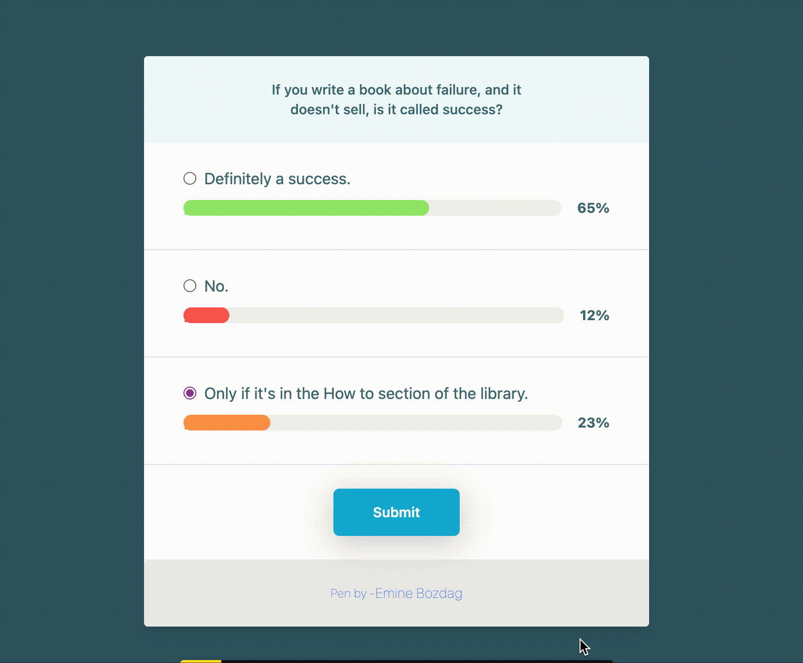
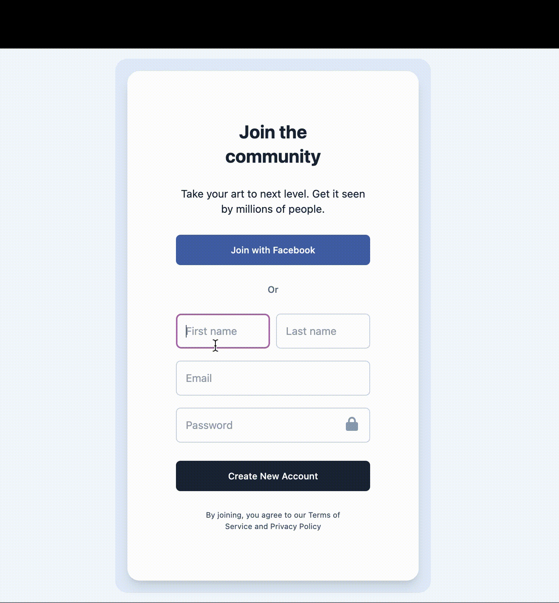

# codepen-ui-works

## Overview

This repository contains UI work that I code daily through codepen.io. While coding these projects, I aim to learn TailwindCSS and improve myself in Mobile-First / Responsive Web Design concepts.

## Projects

### 1. Pagination Buttons

### 2. Poll

### 3. Pricing Card

### 4. Progress Bar

### 5. Team Page

### 6. Signup Page

x

### 7. Movie Card

### 8. Article Page

